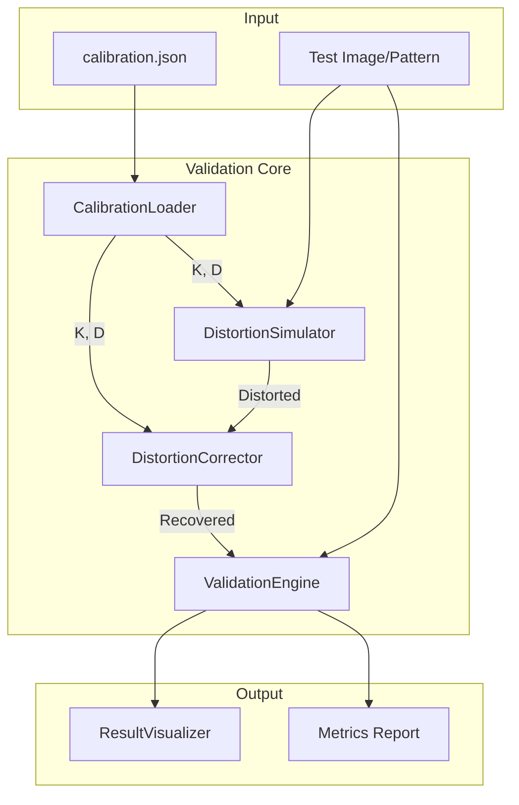

# Design Document

## Overview

本设计实现一个鱼眼相机标定参数验证系统，通过 round-trip 测试验证标定参数的数学一致性。系统核心流程为：加载标定参数 → 生成测试图像 → 添加鱼眼畸变 → 去除畸变 → 对比评估。

系统采用模块化设计，各组件职责清晰：
- `CalibrationLoader`: 负责解析和转换标定参数
- `DistortionSimulator`: 实现正向鱼眼畸变投影
- `ValidationEngine`: 执行 round-trip 测试和指标计算
- `PatternGenerator`: 生成各类测试图案
- `ResultVisualizer`: 可视化验证结果

## Architecture



**数据流说明：**
1. `CalibrationLoader` 从 JSON 加载并转换参数
2. `DistortionSimulator` 使用参数对测试图像添加畸变
3. 现有的 `DistortionCorrector` 对畸变图像去畸变
4. `ValidationEngine` 对比原图和恢复图，计算指标

## Components and Interfaces

### CalibrationLoader

```python
@dataclass
class ParsedCalibration:
    """解析后的标定参数"""
    camera_matrix: np.ndarray      # 3x3 内参矩阵 (像素级)
    dist_coeffs: np.ndarray        # 4x1 畸变系数
    image_size: Tuple[int, int]    # (width, height)
    was_converted: bool            # 是否经过 MATLAB 格式转换
    original_alpha: Optional[float] # 原始缩放因子 (如果有)

class CalibrationLoader:
    def load(self, path: str) -> ParsedCalibration:
        """加载并解析标定文件"""
        
    def _detect_matlab_format(self, data: dict) -> bool:
        """检测是否为 MATLAB 归一化格式"""
        
    def _convert_matlab_to_opencv(self, K: np.ndarray, D: np.ndarray) -> Tuple[np.ndarray, np.ndarray]:
        """将 MATLAB 格式转换为 OpenCV 格式"""
        
    def to_json(self, calib: ParsedCalibration) -> str:
        """序列化为 JSON 字符串"""
```

### DistortionSimulator

```python
class DistortionSimulator:
    """正向鱼眼畸变模拟器"""
    
    def __init__(self, K: np.ndarray, D: np.ndarray):
        self.K = K
        self.D = D
        self._map_x: Optional[np.ndarray] = None
        self._map_y: Optional[np.ndarray] = None
    
    def apply_distortion(self, image: np.ndarray) -> np.ndarray:
        """对无畸变图像添加鱼眼畸变"""
        
    def _build_distortion_map(self, shape: Tuple[int, int]) -> Tuple[np.ndarray, np.ndarray]:
        """构建正向畸变映射表"""
        
    def _fisheye_distort_point(self, x: float, y: float) -> Tuple[float, float]:
        """单点鱼眼畸变计算 (等距投影模型)"""
```

**鱼眼等距投影模型实现：**
```python
def _fisheye_distort_point(self, x_norm: float, y_norm: float) -> Tuple[float, float]:
    """
    OpenCV fisheye equidistant projection:
    r = sqrt(x² + y²)
    θ = atan(r)
    θd = θ(1 + k1θ² + k2θ⁴ + k3θ⁶ + k4θ⁸)
    x' = (θd/r) * x
    y' = (θd/r) * y
    """
    r = np.sqrt(x_norm**2 + y_norm**2)
    if r < 1e-8:
        return x_norm, y_norm
    
    theta = np.arctan(r)
    theta2 = theta * theta
    k1, k2, k3, k4 = self.D.flatten()
    
    theta_d = theta * (1 + k1*theta2 + k2*theta2**2 + k3*theta2**3 + k4*theta2**4)
    
    scale = theta_d / r
    return x_norm * scale, y_norm * scale
```

### ValidationEngine

```python
@dataclass
class ValidationResult:
    """验证结果"""
    psnr: float                    # 峰值信噪比 (dB)
    ssim: float                    # 结构相似性
    max_pixel_error: float         # 最大像素误差
    mean_pixel_error: float        # 平均像素误差
    is_consistent: bool            # 是否数学一致
    original_image: np.ndarray
    distorted_image: np.ndarray
    recovered_image: np.ndarray
    difference_map: np.ndarray

class ValidationEngine:
    def __init__(self, simulator: DistortionSimulator, corrector: DistortionCorrector):
        self.simulator = simulator
        self.corrector = corrector
    
    def run_round_trip(self, image: np.ndarray) -> ValidationResult:
        """执行 round-trip 验证"""
        
    def _compute_psnr(self, img1: np.ndarray, img2: np.ndarray) -> float:
        """计算 PSNR"""
        
    def _compute_ssim(self, img1: np.ndarray, img2: np.ndarray) -> float:
        """计算 SSIM"""
        
    def _compute_difference_map(self, img1: np.ndarray, img2: np.ndarray) -> np.ndarray:
        """计算差异热力图"""
```

### PatternGenerator

```python
class PatternGenerator:
    @staticmethod
    def checkerboard(size: Tuple[int, int], square_size: int = 50) -> np.ndarray:
        """生成棋盘格图案"""
        
    @staticmethod
    def grid_lines(size: Tuple[int, int], spacing: int = 50, thickness: int = 1) -> np.ndarray:
        """生成网格线图案"""
        
    @staticmethod
    def radial_pattern(size: Tuple[int, int], num_rings: int = 10) -> np.ndarray:
        """生成径向同心圆图案"""
        
    @staticmethod
    def load_image(path: str, target_size: Optional[Tuple[int, int]] = None) -> np.ndarray:
        """加载自定义图像"""
```

### ResultVisualizer

```python
class ResultVisualizer:
    def show_comparison(self, result: ValidationResult, title: str = "") -> None:
        """显示三图对比 (原图/畸变/恢复)"""
        
    def show_difference_heatmap(self, result: ValidationResult) -> None:
        """显示差异热力图"""
        
    def annotate_metrics(self, image: np.ndarray, result: ValidationResult) -> np.ndarray:
        """在图像上标注指标"""
        
    def save_report(self, result: ValidationResult, output_dir: str) -> None:
        """保存完整报告到目录"""
```

## Data Models

### 标定参数 JSON Schema

```json
{
  "type": "object",
  "required": ["camera_matrix", "dist_coeffs"],
  "properties": {
    "camera_matrix": {
      "type": "array",
      "items": {"type": "array", "items": {"type": "number"}},
      "description": "3x3 相机内参矩阵"
    },
    "dist_coeffs": {
      "type": "array",
      "items": {"type": "number"},
      "minItems": 4,
      "description": "畸变系数 [k1, k2, k3, k4] 或 [alpha, k1, k2, k3] (MATLAB格式)"
    },
    "image_width": {"type": "integer"},
    "image_height": {"type": "integer"},
    "rms_reprojection_error": {"type": "number"}
  }
}
```

### 验证结果数据结构

```python
@dataclass
class ValidationResult:
    psnr: float                    # 范围: 0 ~ inf, 通常 >30dB 为好
    ssim: float                    # 范围: 0 ~ 1, 通常 >0.95 为好
    max_pixel_error: float         # 最大单像素误差
    mean_pixel_error: float        # 平均像素误差
    is_consistent: bool            # PSNR>30 且 SSIM>0.95
    original_image: np.ndarray     # 原始测试图像
    distorted_image: np.ndarray    # 添加畸变后的图像
    recovered_image: np.ndarray    # 去畸变恢复的图像
    difference_map: np.ndarray     # 差异热力图 (0-255)
```


## Correctness Properties

*A property is a characteristic or behavior that should hold true across all valid executions of a system-essentially, a formal statement about what the system should do. Properties serve as the bridge between human-readable specifications and machine-verifiable correctness guarantees.*

### Property 1: Calibration Serialization Round-Trip

*For any* valid ParsedCalibration object, serializing it to JSON and then deserializing should produce an equivalent ParsedCalibration with identical camera_matrix, dist_coeffs, and image_size values (within floating-point tolerance).

**Validates: Requirements 1.1, 6.4**

### Property 2: MATLAB Format Conversion Correctness

*For any* MATLAB-format calibration where fx_normalized ≈ 1, fy_normalized ≈ 1, and dist_coeffs[0] = alpha > 10, the converted pixel-level focal lengths should satisfy: fx_pixel = alpha × fx_normalized and fy_pixel = alpha × fy_normalized.

**Validates: Requirements 1.2**

### Property 3: Input Validation Completeness

*For any* parsed calibration result, the camera_matrix should have shape (3, 3) and dist_coeffs should have shape (4, 1) or (4,). Invalid inputs should be rejected before reaching this state.

**Validates: Requirements 1.3**

### Property 4: Fisheye Distortion Model Correctness

*For any* normalized image point (x, y), the distorted point (x', y') computed by DistortionSimulator should satisfy the equidistant projection formula: θd = θ(1 + k1θ² + k2θ⁴ + k3θ⁶ + k4θ⁸) where θ = atan(r) and r = sqrt(x² + y²).

**Validates: Requirements 2.1, 2.2**

### Property 5: Output Dimension Invariant

*For any* input image of shape (H, W, C), the output of apply_distortion should have the same shape (H, W, C).

**Validates: Requirements 2.4**

### Property 6: Round-Trip Image Recovery

*For any* undistorted test image and valid calibration parameters, applying distortion followed by undistortion should produce an image that is visually similar to the original (PSNR > 20 dB in the valid region).

**Validates: Requirements 3.1**

### Property 7: PSNR Computation Correctness

*For any* two identical images, PSNR should be infinity (or a very large value). *For any* two images with known MSE, PSNR should equal 10 × log10(MAX² / MSE).

**Validates: Requirements 3.2**

### Property 8: SSIM Computation Correctness

*For any* two identical images, SSIM should equal 1.0. *For any* image compared with its negation, SSIM should be significantly less than 1.0.

**Validates: Requirements 3.3**

### Property 9: Consistency Threshold Classification

*For any* ValidationResult, is_consistent should be True if and only if PSNR > 30 and SSIM > 0.95.

**Validates: Requirements 3.4**

### Property 10: Pattern Generation Correctness

*For any* generated checkerboard pattern with square_size S, pixels at positions (i, j) where (i // S + j // S) is even should have different color than positions where it is odd.

**Validates: Requirements 4.1, 4.2, 4.3**

### Property 11: Difference Heatmap Correctness

*For any* two images img1 and img2, the difference heatmap should have pixel values proportional to |img1 - img2| at each position.

**Validates: Requirements 5.2**

### Property 12: Pretty-Print Formatting

*For any* ParsedCalibration, the pretty-printed string should contain all four focal length and principal point values (fx, fy, cx, cy) and should indicate was_converted status when True.

**Validates: Requirements 6.1, 6.2, 6.3**

## Error Handling

### CalibrationLoader Errors

| Error Condition | Handling Strategy |
|-----------------|-------------------|
| File not found | Raise `FileNotFoundError` with path |
| Invalid JSON syntax | Raise `json.JSONDecodeError` with line number |
| Missing camera_matrix | Raise `ValueError("Missing required field: camera_matrix")` |
| Missing dist_coeffs | Raise `ValueError("Missing required field: dist_coeffs")` |
| Invalid matrix shape | Raise `ValueError("camera_matrix must be 3x3, got {shape}")` |
| Invalid dist_coeffs length | Raise `ValueError("dist_coeffs must have 4 elements, got {n}")` |

### DistortionSimulator Errors

| Error Condition | Handling Strategy |
|-----------------|-------------------|
| Empty input image | Return empty image of same shape |
| Invalid image dtype | Convert to uint8 with warning |
| Numerical overflow in distortion | Clamp coordinates to image bounds |
| Division by zero (r ≈ 0) | Return original point unchanged |

### ValidationEngine Errors

| Error Condition | Handling Strategy |
|-----------------|-------------------|
| Image size mismatch | Resize to match calibration image_size |
| All-black recovered image | Set is_consistent=False, add warning to result |
| PSNR computation failure | Return PSNR=0, log error |

## Testing Strategy

### Property-Based Testing Framework

本项目使用 **Hypothesis** 作为 Python 的 property-based testing 库。

```python
from hypothesis import given, strategies as st
import numpy as np
```

### Unit Tests

单元测试覆盖以下关键场景：

1. **CalibrationLoader**
   - 加载标准 OpenCV 格式 JSON
   - 加载 MATLAB 归一化格式 JSON
   - 处理缺失字段
   - 处理无效数据类型

2. **DistortionSimulator**
   - 中心点畸变 (应保持不变)
   - 边缘点畸变 (应有明显变化)
   - 空图像处理

3. **ValidationEngine**
   - 相同图像的 PSNR/SSIM
   - 已知差异图像的指标计算
   - 阈值判断逻辑

4. **PatternGenerator**
   - 各类图案的尺寸正确性
   - 棋盘格颜色交替性

### Property-Based Tests

每个 correctness property 对应一个 property-based test：

```python
# Property 1: Calibration round-trip
@given(st.floats(100, 2000), st.floats(100, 2000), ...)
def test_calibration_round_trip(fx, fy, cx, cy, k1, k2, k3, k4):
    """
    **Feature: fisheye-calibration-validation, Property 1: Calibration Serialization Round-Trip**
    **Validates: Requirements 1.1, 6.4**
    """
    # Create calibration, serialize, deserialize, compare
    ...

# Property 6: Round-trip image recovery
@given(st.integers(100, 500), st.integers(100, 500))
def test_round_trip_recovery(width, height):
    """
    **Feature: fisheye-calibration-validation, Property 6: Round-Trip Image Recovery**
    **Validates: Requirements 3.1**
    """
    # Generate test image, distort, undistort, check PSNR
    ...
```

### Test Configuration

- Property-based tests: 最少 100 次迭代
- 浮点数比较容差: 1e-6
- PSNR 阈值: 20 dB (round-trip 有效区域)
- SSIM 阈值: 0.9 (round-trip 有效区域)
