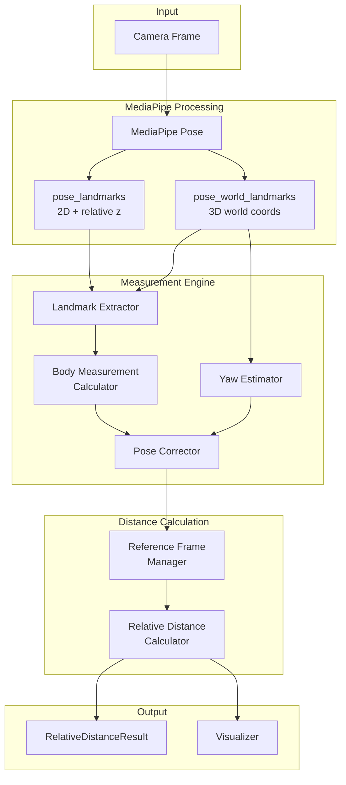

# Design Document: Pose-Corrected Distance Measurement

## Overview

本设计文档描述了一个基于MediaPipe 3D世界坐标的姿态校正距离测量系统。该系统通过利用MediaPipe的`pose_world_landmarks`输出来校正因人物姿态角度导致的2D投影偏差，实现即使在侧身情况下也能准确测量相对距离变化的功能。

### 核心原理

1. **MediaPipe双坐标系统**：
   - `pose_landmarks`: 归一化的2D图像坐标 + 相对深度z
   - `pose_world_landmarks`: 以髋部中心为原点的真实3D世界坐标（单位：米）

2. **姿态校正算法**：
   - 从3D坐标计算身体偏航角（Body_Yaw）
   - 使用 `Corrected_Width = 2D_Width / |cos(yaw)|` 校正投影变形
   - 校正后的宽度不受姿态角度影响

3. **相对距离测量**：
   - 基于针孔相机模型：`2D_Width = 3D_Width × f / Z`
   - 距离比值：`Z_current / Z_ref = Corrected_Width_ref / Corrected_Width_current`

## Architecture



## Components and Interfaces

### 1. Data Structures

```python
@dataclass
class Landmark3D:
    """3D世界坐标关键点"""
    x: float      # 世界坐标x (米)
    y: float      # 世界坐标y (米)
    z: float      # 世界坐标z (米)
    visibility: float

@dataclass
class Landmark2D:
    """2D图像坐标关键点"""
    x: float      # 归一化x (0-1)
    y: float      # 归一化y (0-1)
    z: float      # 相对深度
    visibility: float

@dataclass
class BodyMeasurement:
    """身体测量数据"""
    shoulder_width_3d: float    # 3D肩宽 (米)
    hip_width_3d: float         # 3D胯宽 (米)
    shoulder_width_2d: float    # 2D肩宽 (像素)
    hip_width_2d: float         # 2D胯宽 (像素)
    body_yaw: float             # 身体偏航角 (度)
    confidence: float
    timestamp: float

@dataclass
class RelativeDistanceResult:
    """相对距离测量结果"""
    relative_distance_ratio: float  # 相对距离比值
    shoulder_ratio: float           # 基于肩宽的比值
    hip_ratio: float                # 基于胯宽的比值
    corrected_shoulder_width: float # 校正后肩宽
    corrected_hip_width: float      # 校正后胯宽
    body_orientation: float         # 身体朝向角度
    is_frontal: bool                # 是否正面
    confidence: float
```

### 2. Core Classes

#### PoseCorrectedDistanceEstimator

主要估算器类，负责处理图像帧并输出距离测量结果。

```python
class PoseCorrectedDistanceEstimator:
    # MediaPipe关键点索引
    LEFT_SHOULDER = 11
    RIGHT_SHOULDER = 12
    LEFT_HIP = 23
    RIGHT_HIP = 24
    
    def __init__(self, smoothing_window: int = 5):
        """初始化估算器"""
        
    def process_frame(self, image: np.ndarray) -> Tuple[RelativeDistanceResult, np.ndarray]:
        """处理单帧图像，返回结果和标注图像"""
        
    def set_reference_frame(self, measurement: BodyMeasurement = None):
        """设置参考帧用于相对距离计算"""
        
    def reset(self):
        """重置估算器状态"""
```

#### RelativeDistanceTracker

追踪器类，提供历史数据管理和统计功能。

```python
class RelativeDistanceTracker:
    def __init__(self, history_size: int = 30):
        """初始化追踪器"""
        
    def process(self, image: np.ndarray) -> Tuple[RelativeDistanceResult, np.ndarray]:
        """处理帧并追踪距离变化"""
        
    def calibrate(self):
        """校准（设置当前帧为参考）"""
        
    def get_statistics(self) -> Dict:
        """获取统计信息"""
```

### 3. Key Algorithms

#### 3.1 Body Yaw Estimation

```python
def _estimate_body_yaw(left_shoulder: Landmark3D, right_shoulder: Landmark3D) -> float:
    """
    估算身体偏航角
    
    原理：当人侧身时，左右肩膀的z坐标会有差异
    yaw = atan2(dz, dx)
    
    Returns: 角度（度），正值表示向右转
    """
    dx = right_shoulder.x - left_shoulder.x
    dz = right_shoulder.z - left_shoulder.z
    yaw = math.atan2(dz, dx)
    return math.degrees(yaw)
```

#### 3.2 Pose Correction

```python
def _compute_corrected_width(width_2d: float, body_yaw: float) -> float:
    """
    计算校正后的宽度
    
    公式：Corrected_Width = 2D_Width / |cos(yaw)|
    
    当人侧身时，2D投影宽度会缩小，除以cos(yaw)可以恢复到正面时的宽度
    """
    yaw_rad = math.radians(body_yaw)
    cos_yaw = max(0.1, abs(math.cos(yaw_rad)))  # 防止除零
    return width_2d / cos_yaw
```

#### 3.3 Relative Distance Calculation

```python
def _compute_relative_distance(current: BodyMeasurement, reference: BodyMeasurement) -> float:
    """
    计算相对距离比值
    
    基于针孔相机模型：
    - 2D_Width = 3D_Width × f / Z
    - 因此：Z1/Z2 = 2D_Width2 / 2D_Width1 (假设3D_Width恒定)
    
    使用校正后的宽度来消除姿态影响：
    - ratio = Corrected_Width_ref / Corrected_Width_current
    """
    # 校正当前和参考帧的宽度
    current_corrected = _compute_corrected_width(current.shoulder_width_2d, current.body_yaw)
    ref_corrected = _compute_corrected_width(reference.shoulder_width_2d, reference.body_yaw)
    
    # 距离比值 = 参考宽度 / 当前宽度
    return ref_corrected / current_corrected
```

## Data Models

### MediaPipe Landmark Indices

| Index | Name | Description |
|-------|------|-------------|
| 0 | NOSE | 鼻子 |
| 11 | LEFT_SHOULDER | 左肩 |
| 12 | RIGHT_SHOULDER | 右肩 |
| 23 | LEFT_HIP | 左髋 |
| 24 | RIGHT_HIP | 右髋 |

### Measurement Flow

```
Frame → MediaPipe → Extract 2D & 3D → Compute Yaw → Correct Width → Compare with Reference → Output Ratio
```

## Correctness Properties

*A property is a characteristic or behavior that should hold true across all valid executions of a system-essentially, a formal statement about what the system should do. Properties serve as the bridge between human-readable specifications and machine-verifiable correctness guarantees.*

### Property 1: 3D Euclidean Distance Calculation

*For any* two 3D landmarks with coordinates (x1, y1, z1) and (x2, y2, z2), the computed distance SHALL equal sqrt((x2-x1)² + (y2-y1)² + (z2-z1)²) within floating-point precision.

**Validates: Requirements 1.2**

### Property 2: Visibility Filtering

*For any* landmark with visibility below 0.5, the measurement SHALL be excluded from the result, and *for any* landmark with visibility 0.5 or above, the measurement SHALL be included.

**Validates: Requirements 1.3**

### Property 3: Body Yaw Calculation

*For any* pair of shoulder 3D coordinates, the computed Body_Yaw SHALL equal atan2(dz, dx) converted to degrees, where dz and dx are the z and x differences between right and left shoulders.

**Validates: Requirements 2.1, 2.4**

### Property 4: Frontal/Side Classification

*For any* Body_Yaw angle, the pose SHALL be classified as frontal if |yaw| < 30° and as side view if |yaw| >= 30°.

**Validates: Requirements 2.2**

### Property 5: Pose Correction Formula

*For any* 2D width W and Body_Yaw angle θ, the Corrected_Width SHALL equal W / max(0.1, |cos(θ)|).

**Validates: Requirements 3.1, 3.2**

### Property 6: Pose Correction Stability

*For any* constant physical distance, when body rotation changes from 0° to 45°, the Corrected_Width SHALL remain within 15% of the 0° measurement.

**Validates: Requirements 3.3**

### Property 7: Calibration State Management

*For any* calibration attempt, if confidence >= 0.5 then is_calibrated SHALL become true and Reference_Frame SHALL be set; if confidence < 0.5 then the previous state SHALL be maintained.

**Validates: Requirements 4.1, 4.2, 4.3**

### Property 8: Reset Behavior

*For any* reset operation, is_calibrated SHALL become false and Reference_Frame SHALL be cleared.

**Validates: Requirements 4.4**

### Property 9: Relative Distance Ratio Formula

*For any* calibrated system with Reference_Frame R and current measurement C, the Relative_Distance_Ratio SHALL equal Corrected_Width(R) / Corrected_Width(C).

**Validates: Requirements 5.1**

### Property 10: Direction Indication

*For any* Relative_Distance_Ratio > 1.0, the direction SHALL be "MOVING AWAY"; *for any* ratio < 1.0, the direction SHALL be "APPROACHING"; *for any* ratio == 1.0, the direction SHALL be "STABLE".

**Validates: Requirements 5.2, 5.3**

### Property 11: Weighted Ratio Combination

*For any* measurement with both shoulder_ratio S and hip_ratio H available, the combined_ratio SHALL equal 0.6×S + 0.4×H.

**Validates: Requirements 5.4**

### Property 12: Distance Ratio Accuracy

*For any* 50% increase in physical distance (ratio 1.5), the measured Relative_Distance_Ratio SHALL be within 10% of 1.5 (i.e., between 1.35 and 1.65).

**Validates: Requirements 5.5**

### Property 13: Rotation Robustness

*For any* constant physical distance with body rotation from 0° to 60°, the Relative_Distance_Ratio SHALL remain within 20% of 1.0 (i.e., between 0.8 and 1.2).

**Validates: Requirements 6.1**

### Property 14: Correction Improvement

*For any* 45° body rotation, the error in corrected measurement SHALL be at least 50% smaller than the error in uncorrected measurement.

**Validates: Requirements 6.3**

## Error Handling

| Error Condition | Handling Strategy |
|-----------------|-------------------|
| No pose detected | Return None result, keep previous state |
| Low visibility landmarks | Exclude from measurement, reduce confidence |
| Extreme yaw (>70°) | Reduce confidence by 0.5, warn user |
| Division by near-zero cos | Clamp divisor to 0.1 minimum |
| Calibration with low confidence | Reject calibration, maintain previous state |

## Testing Strategy

### Unit Testing

使用pytest进行单元测试，覆盖：
- 数据结构创建和验证
- 单个函数的正确性（yaw计算、校正公式等）
- 边界条件（极端角度、零值等）

### Property-Based Testing

使用**Hypothesis**库进行属性测试，验证：
- 数学公式的正确性（Property 1, 3, 5, 9, 11）
- 分类逻辑的正确性（Property 2, 4, 10）
- 状态管理的正确性（Property 7, 8）
- 校正效果的有效性（Property 6, 12, 13, 14）

每个属性测试配置运行至少100次迭代。

### Test Data Generation

为了测试姿态校正的有效性，需要生成合成数据：

```python
def generate_synthetic_landmarks(
    shoulder_width_3d: float,  # 真实肩宽（米）
    distance: float,           # 到相机距离（米）
    yaw_angle: float,          # 身体偏航角（度）
    focal_length: float = 500  # 焦距（像素）
) -> Tuple[List[Landmark3D], List[Landmark2D]]:
    """
    生成已知几何关系的合成关键点数据
    
    用于验证：
    1. 3D肩宽应保持恒定
    2. 2D肩宽应随yaw变化：2D = 3D × cos(yaw) × f / distance
    3. 校正后的宽度应恢复到正面值
    """
```

### Integration Testing

- 使用预录制的视频测试完整流程
- 验证实时性能（目标：30fps）
- 验证可视化输出的正确性
