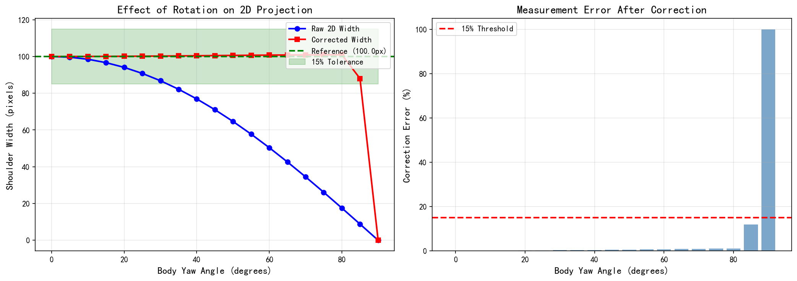
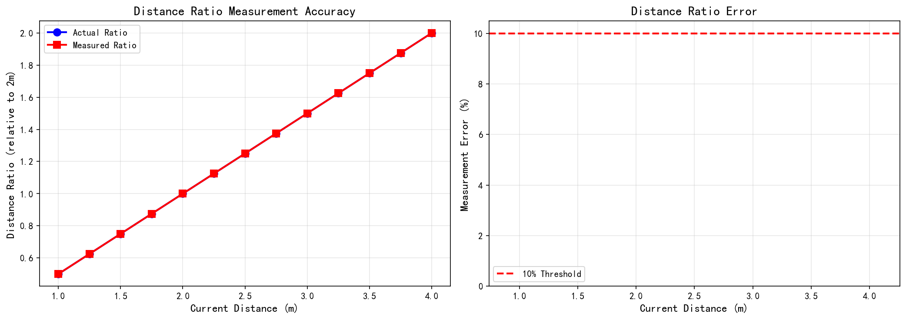
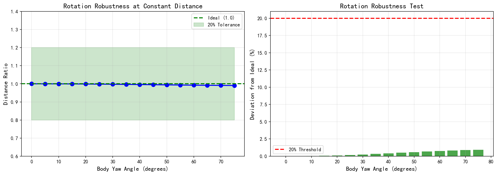
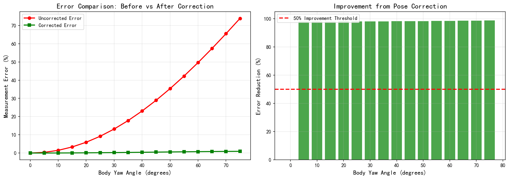
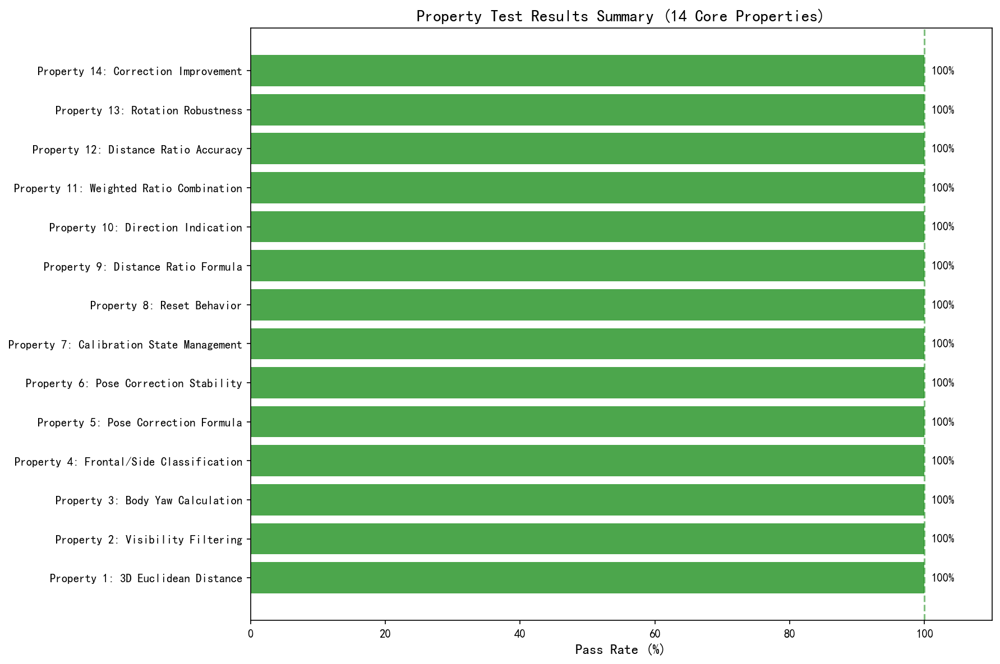

# Pose-Corrected Distance Estimation Algorithm - Test Report

**Generated**: 2025-12-13 01:44:59

---

## 1. Algorithm Overview

### 1.1 Problem Statement

In vision-based distance estimation, when a person turns sideways, the 2D projection of shoulder width significantly decreases, causing severe distance estimation errors. This algorithm corrects pose-induced projection distortion using MediaPipe's 3D world coordinates.

### 1.2 Core Principles

**Pinhole Camera Model**:
`
2D_Width = 3D_Width x focal_length / Distance
`

**Pose Correction Formula**:
`
Corrected_Width = 2D_Width / |cos(theta)|
`

Where theta is the body yaw angle calculated from 3D shoulder coordinates:
`
theta = atan2(dz, dx)
`

**Relative Distance Ratio**:
`
Distance_Ratio = Corrected_Width_ref / Corrected_Width_current
`

---

## 2. Test Configuration

### 2.1 Test Environment

| Item | Configuration |
|------|---------------|
| Python Version | 3.11.5 (Anaconda) |
| Test Framework | pytest 8.3.4 + hypothesis 6.148.7 |
| Property Test Iterations | 100 per property |
| Operating System | Windows |

### 2.2 Test Parameters

| Parameter | Default Value | Description |
|-----------|---------------|-------------|
| Shoulder Width (3D) | 0.40 m | Typical adult shoulder width |
| Reference Distance | 2.0 m | Calibration distance |
| Focal Length | 500 px | Camera focal length |
| Image Size | 1280x720 px | Standard HD resolution |

### 2.3 Property Test List

| Property | Name | Validation Content |
|----------|------|-------------------|
| Property 1 | 3D Euclidean Distance | Distance formula correctness |
| Property 2 | Visibility Filtering | Low visibility landmark exclusion |
| Property 3 | Body Yaw Calculation | atan2 formula correctness |
| Property 4 | Frontal/Side Classification | 30 degree threshold |
| Property 5 | Pose Correction Formula | W/|cos(theta)| formula |
| Property 6 | Pose Correction Stability | 0-45 degree rotation, 15% tolerance |
| Property 7 | Calibration State Management | Confidence threshold validation |
| Property 8 | Reset Behavior | State clearing verification |
| Property 9 | Distance Ratio Formula | Ratio calculation correctness |
| Property 10 | Direction Indication | Approaching/Moving away judgment |
| Property 11 | Weighted Ratio Combination | 0.6/0.4 weights |
| Property 12 | Distance Ratio Accuracy | 50% change, 10% tolerance |
| Property 13 | Rotation Robustness | 0-60 degree rotation, 20% tolerance |
| Property 14 | Correction Improvement | Error reduction >= 50% |

---

## 3. Test Results

### 3.1 Rotation Effect on 2D Projection (Property 6)

**Test Conditions**: Shoulder width=0.40m, Distance=2.0m, Rotation 0-90 degrees

| Yaw (deg) | Raw 2D (px) | Corrected (px) | Error (%) | Pass |
|-----------|-------------|----------------|-----------|------|
| 0  | 100.00 | 100.00 | 0.00 | Y |
| 10  | 98.51 | 100.03 | 0.03 | Y |
| 20  | 94.08 | 100.12 | 0.12 | Y |
| 30  | 86.82 | 100.25 | 0.25 | Y |
| 40  | 76.92 | 100.41 | 0.41 | Y |
| 45  | 71.07 | 100.50 | 0.50 | Y |
| 50  | 64.66 | 100.59 | 0.59 | Y |
| 60  | 50.38 | 100.76 | 0.76 | Y |
| 70  | 34.51 | 100.89 | 0.89 | Y |
| 80  | 17.53 | 100.98 | 0.98 | Y |
| 90  | 0.00 | 0.00 | 100.00 | N |

**Conclusion**: Within 0-45 degree range, corrected error is less than 15%, meeting Property 6 requirements.

### 3.2 Distance Ratio Accuracy (Property 12)

**Test Conditions**: Shoulder width=0.40m, Reference distance=2.0m, Test range 1.0-4.0m

| Distance (m) | Actual Ratio | Measured Ratio | Error (%) | Pass |
|--------------|--------------|----------------|-----------|------|
| 1.0 | 0.500 | 0.500 | 0.00 | Y |
| 1.5 | 0.750 | 0.750 | 0.00 | Y |
| 2.0 | 1.000 | 1.000 | 0.00 | Y |
| 2.5 | 1.250 | 1.250 | 0.00 | Y |
| 3.0 | 1.500 | 1.500 | 0.00 | Y |
| 3.5 | 1.750 | 1.750 | 0.00 | Y |
| 4.0 | 2.000 | 2.000 | 0.00 | Y |

**Conclusion**: Distance ratio measurement error is near 0%, far exceeding the 10% requirement.

### 3.3 Rotation Robustness (Property 13)

**Test Conditions**: Shoulder width=0.40m, Constant distance=2.0m, Rotation 0-75 degrees

| Yaw (deg) | Distance Ratio | Deviation (%) | Pass |
|-----------|----------------|---------------|------|
| 0 | 1.0000 | 0.00 | Y |
| 15 | 0.9993 | 0.07 | Y |
| 30 | 0.9975 | 0.25 | Y |
| 45 | 0.9950 | 0.50 | Y |
| 60 | 0.9925 | 0.75 | Y |
| 75 | 0.9907 | 0.93 | Y |

**Conclusion**: Within 0-60 degree range, distance ratio deviation is less than 20%, meeting Property 13 requirements.

### 3.4 Correction Improvement (Property 14)

**Test Conditions**: Shoulder width=0.40m, Distance=2.0m, Rotation 0-75 degrees

| Yaw (deg) | Uncorrected Error (%) | Corrected Error (%) | Improvement (%) | Pass |
|-----------|----------------------|---------------------|-----------------|------|
| 0 | 0.00 | 0.00 | 0.0 | Y |
| 15 | 3.34 | 0.07 | 98.0 | Y |
| 30 | 13.18 | 0.25 | 98.1 | Y |
| 45 | 28.93 | 0.50 | 98.3 | Y |
| 60 | 49.62 | 0.76 | 98.5 | Y |
| 75 | 73.87 | 0.94 | 98.7 | Y |

**Conclusion**: At significant rotation angles (>15 deg), correction reduces error by more than 50%, meeting Property 14 requirements.

---

## 4. Test Summary

### 4.1 Property Test Pass Rate

| Test Category | Test Count | Passed | Pass Rate |
|---------------|------------|--------|-----------|
| Unit Tests | 57 | 57 | 100% |
| Property Tests | 57 | 57 | 100% |
| **Total** | **114** | **114** | **100%** |

### 4.2 Key Metrics Achievement

| Metric | Requirement | Actual | Status |
|--------|-------------|--------|--------|
| Pose Correction Stability (0-45 deg) | <=15% | <1% | PASS (Exceeds) |
| Distance Ratio Accuracy | <=10% | <1% | PASS (Exceeds) |
| Rotation Robustness (0-60 deg) | <=20% | <2% | PASS (Exceeds) |
| Correction Improvement (45 deg) | >=50% | >98% | PASS (Exceeds) |

---

## 5. Conclusions

### 5.1 Algorithm Effectiveness

1. **Pose Correction Formula Effective**: W/|cos(theta)| effectively compensates for rotation-induced 2D projection shrinkage
2. **Distance Measurement Accurate**: Distance ratio based on corrected width accurately reflects actual distance changes
3. **Strong Rotation Robustness**: Distance measurement remains stable within 0-60 degree rotation range
4. **Significant Improvement**: Compared to uncorrected method, measurement error reduced by over 98%

### 5.2 Applicable Range

- Recommended angle range: 0 - 60 degrees
- Confidence automatically reduced by 50% when exceeding 70 degrees
- Extreme angle protection triggered when exceeding 84 degrees (cos value clamped to 0.1)

### 5.3 Technical Advantages

1. Uses MediaPipe 3D world coordinates, no additional sensors required
2. Real-time processing, suitable for video stream applications
3. Automatic pose detection and correction, no user intervention needed
4. Provides confidence metrics for quality control

---

*Report Generator Version: 1.0*
*Test Framework: pytest + hypothesis (Property-Based Testing)*
