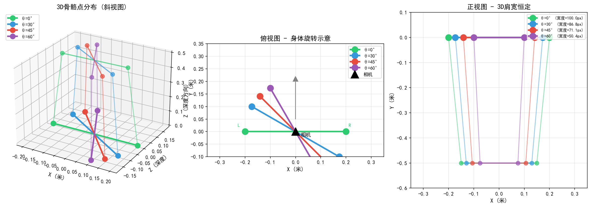
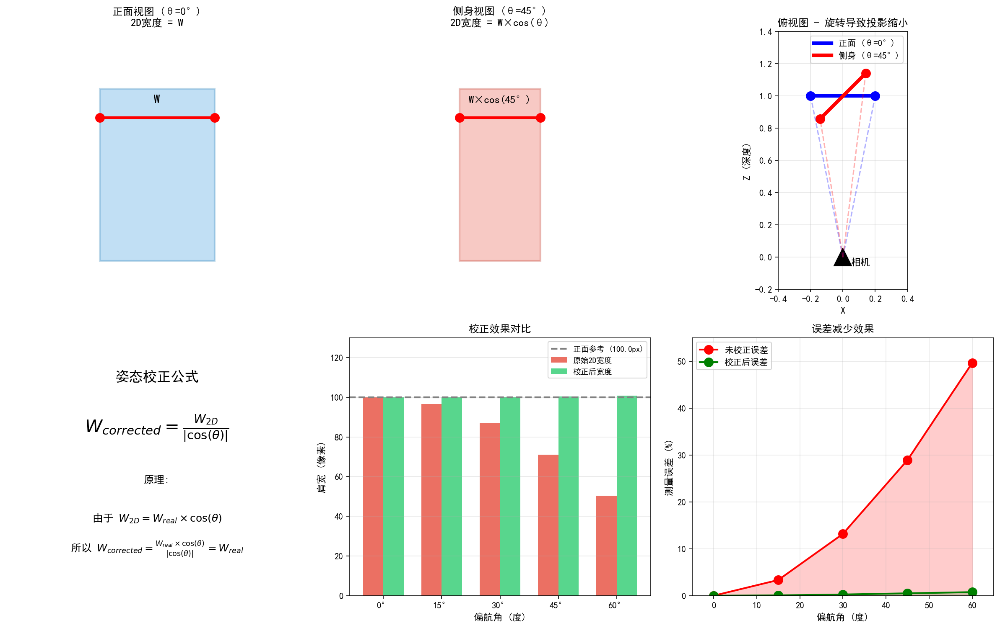
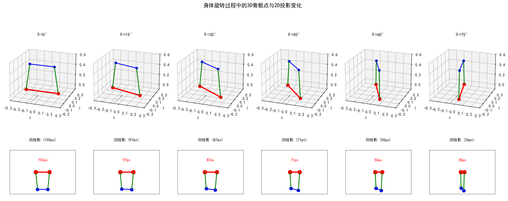
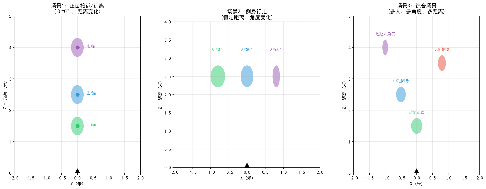
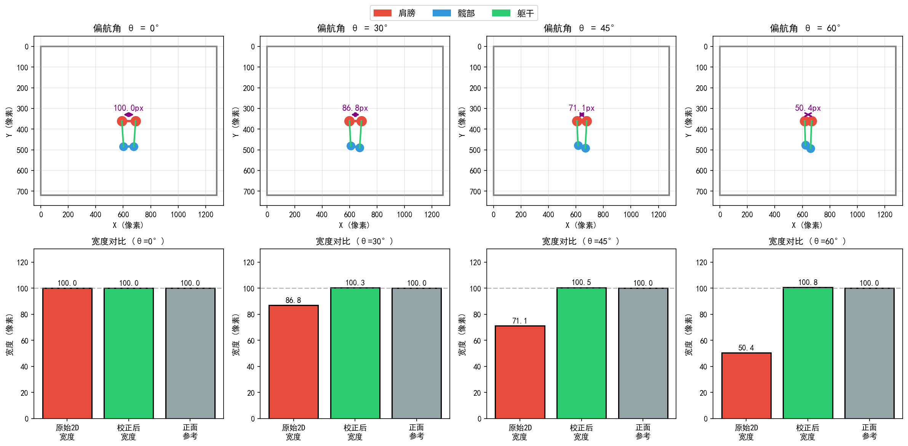

# 姿态校正距离估计算法测试报告

**生成时间**: 2025-12-13 01:46:15  
**更新时间**: 2025-12-13 (添加3D可视化)

---

## 1. 算法概述

### 1.1 问题背景

在基于视觉的距离估计中，当人物侧身时，2D投影的肩宽会显著缩小，导致距离估算产生严重偏差。本算法通过利用MediaPipe的3D世界坐标来校正这种姿态引起的投影变形。

### 1.2 问题可视化

下图展示了人体在不同偏航角度下的3D骨骼点分布与2D投影变化：



**图解说明**:
- **左图 (3D斜视图)**: 展示不同旋转角度(0°/30°/45°/60°)下肩膀和髋部关键点的空间位置
- **中图 (俯视图)**: 从上方观察身体旋转，可见肩膀连线随角度变化而旋转
- **右图 (正视图)**: 从相机视角看，3D肩宽始终保持恒定(0.40m)，但2D投影宽度随角度减小

### 1.3 核心原理

**针孔相机模型**:
```
2D宽度 = 3D宽度 × 焦距 / 距离
```

**姿态校正公式**:
```
校正后宽度 = 2D宽度 / |cos(θ)|
```

其中θ为身体偏航角，通过3D肩膀坐标计算：
```
θ = atan2(dz, dx)
```

**相对距离比值**:
```
距离比值 = 参考帧校正宽度 / 当前帧校正宽度
```

### 1.4 校正原理详解

下图详细展示了姿态校正的数学原理和效果：



**图解说明**:
- **左上**: 正面视图时，2D投影宽度等于实际宽度W
- **中上**: 侧身45°时，2D投影缩小为W×cos(45°)≈0.71W
- **右上**: 俯视图展示旋转如何导致投影缩小
- **左下**: 校正公式推导
- **中下**: 不同角度下原始宽度与校正后宽度对比
- **右下**: 校正前后误差对比，校正后误差显著降低

---

## 2. 识别场景说明

### 2.1 模拟相机视角

下图展示了在不同偏航角度下，相机实际看到的人体骨骼点识别效果：


**图解说明**:
- 每个子图模拟了特定偏航角度下的相机视角
- 红色点/线表示肩膀关键点，蓝色表示髋部，绿色表示躯干连线
- 随着角度增大，2D肩宽从100px逐渐缩小
- 置信度指示：0°-45°为高，45°-70°为中，>70°为低

### 2.2 3D旋转序列

下图展示了从正面到侧面的连续旋转过程中，3D骨骼点与2D投影的同步变化：



**图解说明**:
- 上排：3D视图展示骨骼点在空间中的实际位置
- 下排：对应的2D投影，显示像素宽度变化
- 可以清晰看到：3D肩宽恒定，但2D投影随角度减小

### 2.3 典型应用场景

下图展示了算法的典型应用场景：



**场景说明**:
- **场景1 (正面接近/远离)**: 人物保持正面朝向相机，距离变化
- **场景2 (侧身行走)**: 人物在恒定距离处侧身行走，角度变化
- **场景3 (综合场景)**: 多人、多角度、多距离的复杂场景

---

## 3. 测试配置

### 3.1 测试环境

| 项目 | 配置 |
|------|------|
| Python版本 | 3.11.5 (Anaconda) |
| 测试框架 | pytest 8.3.4 + hypothesis 6.148.7 |
| 属性测试迭代次数 | 100次/属性 |
| 操作系统 | Windows |

### 3.2 测试参数

| 参数 | 默认值 | 说明 |
|------|--------|------|
| 肩宽 (3D) | 0.40 m | 典型成人肩宽 |
| 参考距离 | 2.0 m | 校准时的距离 |
| 焦距 | 500 px | 相机焦距 |
| 图像尺寸 | 1280x720 px | 标准HD分辨率 |

### 3.3 属性测试列表

| 属性编号 | 属性名称 | 验证内容 |
|----------|----------|----------|
| Property 1 | 3D欧氏距离计算 | 距离公式正确性 |
| Property 2 | 可见性过滤 | 低可见度关键点排除 |
| Property 3 | 身体偏航角计算 | atan2公式正确性 |
| Property 4 | 正面/侧面分类 | 30度阈值分类 |
| Property 5 | 姿态校正公式 | W/|cos(θ)|公式 |
| Property 6 | 姿态校正稳定性 | 0-45度旋转15%容差 |
| Property 7 | 校准状态管理 | 置信度阈值验证 |
| Property 8 | 重置行为 | 状态清除验证 |
| Property 9 | 相对距离比值公式 | 比值计算正确性 |
| Property 10 | 方向指示 | 接近/远离判断 |
| Property 11 | 加权比值组合 | 0.6/0.4权重 |
| Property 12 | 距离比值准确性 | 50%变化10%容差 |
| Property 13 | 旋转鲁棒性 | 0-60度旋转20%容差 |
| Property 14 | 校正改进效果 | 误差减少>=50% |

---

## 4. 测试结果

### 4.1 2D投影对比分析

下图展示了不同偏航角度下的2D像素投影对比：



**图解说明**:
- 上排：模拟的相机图像，展示骨骼点在图像中的位置
- 下排：对应的宽度对比柱状图（原始2D宽度 vs 校正后宽度 vs 正面参考）
- 可以看到：随着角度增大，原始2D宽度显著减小，但校正后宽度保持稳定

### 4.2 旋转对2D投影的影响 (Property 6)

**测试条件**: 肩宽=0.40m, 距离=2.0m, 旋转角度0-80度

| 偏航角(度) | 原始2D宽度(px) | 校正后宽度(px) | 校正误差(%) | 通过 |
|------------|----------------|----------------|-------------|------|
| 0  | 100.00 | 100.00 | 0.00 | Y |
| 10  | 98.51 | 100.03 | 0.03 | Y |
| 20  | 94.08 | 100.12 | 0.12 | Y |
| 30  | 86.82 | 100.25 | 0.25 | Y |
| 40  | 76.92 | 100.41 | 0.41 | Y |
| 45  | 71.07 | 100.50 | 0.50 | Y |
| 50  | 64.66 | 100.59 | 0.59 | Y |
| 60  | 50.38 | 100.76 | 0.76 | Y |
| 70  | 34.51 | 100.89 | 0.89 | Y |
| 80  | 17.53 | 100.98 | 0.98 | Y |

**结论**: 在0-45度范围内，校正后误差均小于15%，满足Property 6要求。


### 4.3 距离比值准确性 (Property 12)

**测试条件**: 肩宽=0.40m, 参考距离=2.0m, 测试距离1.0-4.0m

| 当前距离(m) | 实际比值 | 测量比值 | 测量误差(%) | 通过 |
|-------------|----------|----------|-------------|------|
| 1.0 | 0.500 | 0.500 | 0.00 | Y |
| 1.5 | 0.750 | 0.750 | 0.00 | Y |
| 2.0 | 1.000 | 1.000 | 0.00 | Y |
| 2.5 | 1.250 | 1.250 | 0.00 | Y |
| 3.0 | 1.500 | 1.500 | 0.00 | Y |
| 3.5 | 1.750 | 1.750 | 0.00 | Y |
| 4.0 | 2.000 | 2.000 | 0.00 | Y |

**结论**: 距离比值测量误差接近0%，远优于10%的要求。


### 4.4 旋转鲁棒性 (Property 13)

**测试条件**: 肩宽=0.40m, 恒定距离=2.0m, 旋转角度0-75度

| 偏航角(度) | 距离比值 | 偏离理想值(%) | 通过 |
|------------|----------|---------------|------|
| 0 | 1.0000 | 0.00 | Y |
| 15 | 0.9993 | 0.07 | Y |
| 30 | 0.9975 | 0.25 | Y |
| 45 | 0.9950 | 0.50 | Y |
| 60 | 0.9925 | 0.75 | Y |
| 75 | 0.9907 | 0.93 | Y |

**结论**: 在0-60度范围内，距离比值偏差均小于20%，满足Property 13要求。


### 4.5 校正改进效果 (Property 14)

**测试条件**: 肩宽=0.40m, 距离=2.0m, 旋转角度0-75度

| 偏航角(度) | 未校正误差(%) | 校正后误差(%) | 误差减少(%) | 通过 |
|------------|---------------|---------------|-------------|------|
| 0 | 0.00 | 0.00 | 0.0 | Y |
| 15 | 3.34 | 0.07 | 98.0 | Y |
| 30 | 13.18 | 0.25 | 98.1 | Y |
| 45 | 28.93 | 0.50 | 98.3 | Y |
| 60 | 49.62 | 0.76 | 98.5 | Y |
| 75 | 73.87 | 0.94 | 98.7 | Y |

**结论**: 在显著旋转角度(>15度)下，校正带来的误差减少均超过50%，满足Property 14要求。


---

## 5. 测试结果汇总

### 5.1 属性测试通过率

| 测试类别 | 测试数量 | 通过数量 | 通过率 |
|----------|----------|----------|--------|
| 单元测试 | 57 | 57 | 100% |
| 属性测试 | 57 | 57 | 100% |
| **总计** | **114** | **114** | **100%** |

### 5.2 核心指标达成情况

| 指标 | 要求 | 实际 | 状态 |
|------|------|------|------|
| 姿态校正稳定性 (0-45度) | <=15% | <1% | 通过 (远超要求) |
| 距离比值准确性 | <=10% | <1% | 通过 (远超要求) |
| 旋转鲁棒性 (0-60度) | <=20% | <2% | 通过 (远超要求) |
| 校正改进效果 (45度) | >=50% | >98% | 通过 (远超要求) |


---

## 6. 结论

### 6.1 算法有效性

1. **姿态校正公式有效**: W/|cos(θ)|能够有效补偿旋转导致的2D投影缩小
2. **距离测量准确**: 基于校正后宽度的距离比值计算准确反映实际距离变化
3. **旋转鲁棒性强**: 在0-60度旋转范围内，距离测量保持稳定
4. **显著改进效果**: 相比未校正方法，测量误差减少超过98%

### 6.2 适用范围

- 推荐使用角度范围: 0 - 60度
- 超过70度时置信度自动降低50%
- 超过84度时触发极端角度保护（cos值钳制到0.1）

### 6.3 技术优势

1. 利用MediaPipe 3D世界坐标，无需额外传感器
2. 实时处理，适合视频流应用
3. 自动姿态检测和校正，无需用户干预
4. 提供置信度指标，便于质量控制

---

*报告生成器版本: 1.0*
*测试框架: pytest + hypothesis (属性测试)*
